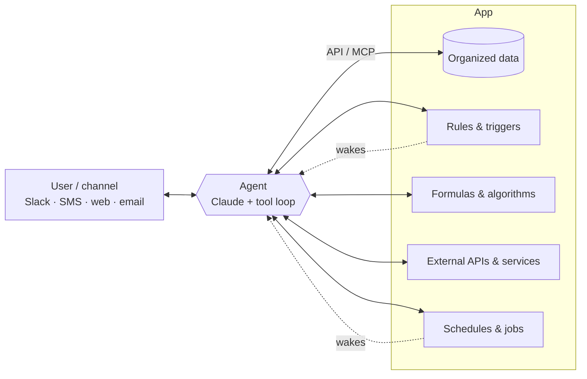
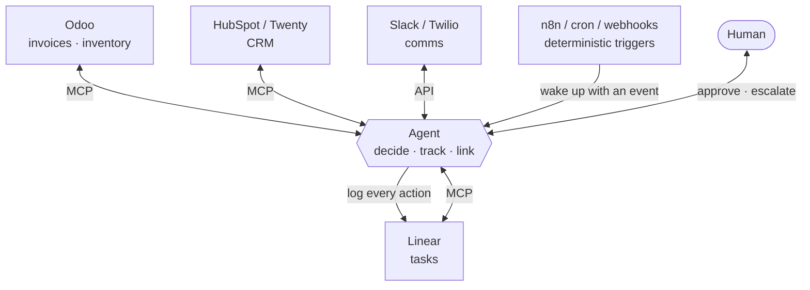

# Slow Hackathon 201

## Advanced AI Coding

---

# How to Build Complex Apps

- Start from a real stack: [T3](https://create.t3.gg/) (Next.js, tRPC, Prisma, Tailwind)
- Typed API layer: [tRPC](https://trpc.io/) or [Hono](https://hono.dev/)
- Background jobs: [Trigger.dev](https://trigger.dev/), [Inngest](https://www.inngest.com/), [BullMQ](https://bullmq.io/)
- Data: [Postgres](https://www.postgresql.org/) on [Neon](https://neon.tech/), [Redis](https://upstash.com/), hosting on [Vercel](https://vercel.com/) or [Railway](https://railway.com/)
- Auth: [Better Auth](https://www.better-auth.com/), [Clerk](https://clerk.com/)
- Packages: [npm](https://www.npmjs.com/), monorepos with [Turborepo](https://turbo.build/)
- Migrations: [Prisma](https://www.prisma.io/) or [Drizzle](https://orm.drizzle.team/)
- Files: [UploadThing](https://uploadthing.com/), [S3](https://aws.amazon.com/s3/), [Vercel Blob](https://vercel.com/docs/vercel-blob)
- CI: [GitHub Actions](https://github.com/features/actions)
- UI: [Tailwind](https://tailwindcss.com/) and [shadcn/ui](https://ui.shadcn.com/)
- Real product process

---

# Discuss the Feature in Depth

- Talk it through before writing code
- Voice input: [Wispr Flow](https://wisprflow.ai/)
- Meeting capture: [Fathom](https://fathom.video)
- Paste the transcript into the conversation

<a href="https://wisprflow.ai/"></a>

---

# Plan It

- Plan mode, reading and discussing the plan
- [Mermaid](https://mermaid.js.org/) diagrams and database structure
- Commit the plan to `./docs`
- Ticket-sized chunks (beads, [Linear](https://linear.app/), etc)


---

# Build It

<div class="grid grid-cols-5 gap-6">
<div class="col-span-2">

- `/ralph-loop`
- Fable 5.1 as orchestrator
- Opus subagents, one per ticket
- [beads](https://github.com/steveyegge/beads) tracks ticket dependencies
- Blocked tickets wait for their deps
- CI keeps each branch green
- Merge when everything passes

</div>
<div class="col-span-3 text-xs">

<style>
.g { display: grid; grid-template-columns: 6rem repeat(8, 1fr); column-gap: 2px; row-gap: 6px; align-items: center; }
.g .lbl { opacity: .8; padding-right: .5rem; }
.g .bar { height: 1.4rem; border-radius: 4px; display: flex; align-items: center; justify-content: space-between; padding: 0 .4rem; font-size: .65rem; white-space: nowrap; }
.g .opus { background: #4c6ef5; color: #fff; }
.g .fable { background: #7c3aed; color: #fff; }
.g .wait { border: 1px dashed #666; opacity: .6; justify-content: center; }
.g .ci { color: #4ade80; }
.g .merge { background: #16a34a; color: #fff; justify-content: center; }
.g .tick { text-align: center; opacity: .4; border-bottom: 1px solid #444; }
</style>

<div class="g">
  <div class="tick" style="grid-row:1;grid-column:2">t1</div><div class="tick" style="grid-row:1;grid-column:3">t2</div><div class="tick" style="grid-row:1;grid-column:4">t3</div><div class="tick" style="grid-row:1;grid-column:5">t4</div><div class="tick" style="grid-row:1;grid-column:6">t5</div><div class="tick" style="grid-row:1;grid-column:7">t6</div><div class="tick" style="grid-row:1;grid-column:8">t7</div><div class="tick" style="grid-row:1;grid-column:9">t8</div>

  <div class="lbl" style="grid-row:2;grid-column:1">Fable 5.1</div>
  <div class="bar fable" style="grid-row:2;grid-column:2/span 8"><span>orchestrate · assign · review</span><span>▶ merge</span></div>

  <div class="lbl" style="grid-row:3;grid-column:1">A · schema</div>
  <div class="bar opus" style="grid-row:3;grid-column:2/span 2"><span>Opus</span><span class="ci">CI ✓</span></div>

  <div class="lbl" style="grid-row:4;grid-column:1">B · seed data</div>
  <div class="bar opus" style="grid-row:4;grid-column:2/span 1"><span>Opus</span><span class="ci">✓</span></div>

  <div class="lbl" style="grid-row:5;grid-column:1">C · API</div>
  <div class="bar wait" style="grid-row:5;grid-column:2/span 2">waits on A</div>
  <div class="bar opus" style="grid-row:5;grid-column:4/span 2"><span>Opus</span><span class="ci">CI ✓</span></div>

  <div class="lbl" style="grid-row:6;grid-column:1">D · UI</div>
  <div class="bar wait" style="grid-row:6;grid-column:2/span 2">waits on A</div>
  <div class="bar opus" style="grid-row:6;grid-column:4/span 3"><span>Opus</span><span class="ci">CI ✓</span></div>

  <div class="lbl" style="grid-row:7;grid-column:1">E · integration</div>
  <div class="bar wait" style="grid-row:7;grid-column:2/span 5">waits on C, D</div>
  <div class="bar opus" style="grid-row:7;grid-column:7/span 2"><span>Opus</span><span class="ci">CI ✓</span></div>

  <div class="lbl" style="grid-row:8;grid-column:1">main</div>
  <div class="bar merge" style="grid-row:8;grid-column:9/span 1">merge</div>
</div>

</div>
</div>

---

# Test It

- `/run-ci-local`
- Smoke test with Chrome
- QA it yourself


---

# Chrome Integration

**Claude in Chrome** is built into Claude Desktop. Or from the CLI:

```bash
claude --chrome
```

**Chrome DevTools MCP** drives a real Chrome session with persistence. Sometimes works better.

```bash
claude mcp add chrome-devtools -- npx chrome-devtools-mcp@latest
```

Both navigate, click, fill forms, read console errors, take screenshots, and run Lighthouse audits.

---

# Chrome in Action

```text
Open localhost:3000, try submitting the login form
with invalid data, and check if the error messages
appear correctly.
```

```text
Check the console for errors on the dashboard page.
```

```text
Record a GIF showing the checkout flow from cart
to confirmation.
```

Shares your browser's login state — works with authenticated apps.

---

# Turn Procedures into Skills

Ask Claude to write the skill for itself.

```text
Turn the CI steps we just ran into a skill called /run-ci-local.
Restrict it to Bash, Read, and Grep. Only I can invoke it.
```

Claude writes `.claude/skills/run-ci-local/SKILL.md`, checked into git, shared with the team.

- Anything you've explained twice becomes a skill
- Skills can take arguments: `/run-ci-local spec/models`
- Skills can pull live context: current branch, recent diff, test output

---

# Ship It

- Pull request
- Code review
- Deploy

---

# Deploy with Vercel

**Step 1** — Add the [Vercel MCP](https://vercel.com/docs/agent-resources/vercel-mcp):

```bash
claude mcp add --transport http vercel https://mcp.vercel.com
```

**Step 2** — Deploy:

```text
Deploy this project to Vercel as a preview.
```

On first use, your browser opens for OAuth — authorize and you're connected. Claude handles the deploy, reads build logs, and fixes errors in one loop.

---

# Vercel MCP Capabilities

Beyond deploying, Claude can:

- Check deployment status and build logs
- Debug failed deployments and fix the code
- Manage environment variables
- Search [Vercel docs](https://vercel.com/docs) for you

Project-specific URL for auto-context:

```text
https://mcp.vercel.com/<team-slug>/<project-slug>
```

---
layout: section
---

# Complex Patterns and Solutions

---

# Background Jobs & Scheduling

- [Trigger.dev](https://trigger.dev/): define tasks, call from your app, runs on their infra, no timeouts
- [Inngest](https://www.inngest.com/): event-driven functions, retries, cron
- [BullMQ](https://bullmq.io/) + Redis when you run your own workers
- [Vercel Cron Jobs](https://vercel.com/docs/cron-jobs): hit a route on a schedule
- `after()`: fire-and-forget work after the response, built into Next.js

Vercel functions time out at 60s Hobby / 300s Pro. Use Trigger.dev or Inngest for anything longer.

---

# Media & Communications

- Image and video thumbnails: [sharp](https://sharp.pixelplumbing.com/), [FFmpeg](https://ffmpeg.org/), [Mux](https://www.mux.com/)
- File uploads: [UploadThing](https://uploadthing.com/), [S3](https://aws.amazon.com/s3/)
- Phone / text: [Twilio](https://twilio.com/)
- Email: [Resend](https://resend.com/), [Postmark](https://postmarkapp.com/)
- Push notifications: [Firebase Cloud Messaging](https://firebase.google.com/docs/cloud-messaging), [OneSignal](https://onesignal.com/)

---

# Integrating AI

<div class="grid grid-cols-5 gap-6">
<div class="col-span-3">

- Image generation: [GPT-Image-2.5](https://openai.com/index/introducing-chatgpt-images-2-5/), [Nano Banana 2](https://blog.google/innovation-and-ai/technology/ai/nano-banana-2/)
- Video generation: [Veo 3.1](https://deepmind.google/models/veo/), [Seedance 2.0](https://fal.ai/seedance-2.0), [Kling 3.0](https://klingai.com/)
- Speech to text: [ElevenLabs Scribe v2](https://elevenlabs.io/speech-to-text), [Deepgram Nova-3](https://deepgram.com/)
- Text to speech: [ElevenLabs v3](https://elevenlabs.io/text-to-speech), [Inworld TTS](https://inworld.ai/tts)
- Music: [Suno v5.5](https://suno.com/), [Udio](https://www.udio.com/)
- Image understanding: [Gemini 3.5 Flash](https://ai.google.dev/gemini-api/docs/whats-new-gemini-3.5)
- Document understanding: [Claude](https://docs.anthropic.com/en/docs/build-with-claude/pdf-support)
- Chatbots on site: [Claude](https://docs.anthropic.com/en/docs/initial-setup)

</div>
<div class="col-span-2 flex flex-col gap-3">
  <a href="https://openai.com/index/introducing-chatgpt-images-2-5/"></a>
  <a href="https://blog.google/innovation-and-ai/technology/ai/nano-banana-2/"></a>
</div>
</div>

---

# Performance & APIs

- N+1 queries: Prisma `include`, [Drizzle relational queries](https://orm.drizzle.team/docs/rqb)
- Database indexes
- REST with [Hono](https://hono.dev/), typed RPC with [tRPC](https://trpc.io/), [GraphQL Yoga](https://the-guild.dev/graphql/yoga-server)
- Caching: [Upstash Redis](https://upstash.com/), Next.js `revalidate`
- Agents and communication channels
- Training classic ML models on generated training sets

---
layout: section
---

# Cyborg Apps

## Agent + App


---

# What Is a Cyborg App?

An agent, an app, and an API or MCP between them.



---

# The App Side

- Organized data (Postgres, records, history)
- Deterministic rules: when X happens, do Y
- Formulas and algorithms in code
- External APIs wrapped as tools
- Schedules, queues, webhooks that wake the agent

---

# The Agent Side

- Decides when to use which tool
- Handles messy input: email, voice notes, screenshots
- Makes judgment calls
- Tracks progress across tools
- Links tools that were never integrated
- Talks to people where they already are
- Escalates to a human

---

# Wiring It Up

- [Anthropic SDK](https://docs.anthropic.com/en/docs/initial-setup) tool-use loop in [Slack](https://api.slack.com/), [Discord](https://discord.com/developers/docs), SMS, or your UI
- Tool definitions over your own API, or an [MCP server](https://modelcontextprotocol.io/) on your app
- One thread per record, thread ID stored on the record

```ts
{
  name: "record_checkin",
  description: "Store a client's daily check-in and return their updated streak",
  input_schema: {
    type: "object",
    properties: { clientId: { type: "string" }, mood: { type: "integer" } },
    required: ["clientId", "mood"],
  },
}
```

---

# You Don't Have to Build the App

Point the agent at software that already exists. [Odoo](https://www.odoo.com/): CRM, invoicing, inventory, HR, projects, accounting, one API.

What mature software brings:

- Deterministic, repeatable operations
- Schemas, relations, validation
- Audit trail and history
- Permissions, roles, approvals
- Reports and dashboards
- Recurring billing, reminders, retries
- Workflows built by people who've done the job
- A UI your team already uses
- Cheap to run

---

# Building Blocks by Category

<div class="text-sm">

| Category | Open source | SaaS | Agent access |
| --- | --- | --- | --- |
| Business ops / ERP | [Odoo](https://www.odoo.com/), [ERPNext](https://erpnext.com/) | NetSuite | JSON-RPC, community MCP |
| CRM | [Twenty](https://twenty.com/) | [HubSpot](https://www.hubspot.com/), [Attio](https://attio.com/) | Official MCP / REST |
| Tickets & projects | [Plane](https://plane.so/) | [Linear](https://linear.app/), GitHub Issues | Official MCP |
| Structured data | [NocoDB](https://nocodb.com/), [Baserow](https://baserow.io/) | [Airtable](https://airtable.com/), Google Sheets | REST / community MCP |
| Triggers & automation | [n8n](https://n8n.io/) | [Zapier](https://zapier.com/), [Trigger.dev](https://trigger.dev/) | Webhooks in and out, MCP |
| Docs & knowledge | [Outline](https://www.getoutline.com/) | [Notion](https://www.notion.so/) | Official MCP |
| Commerce | [Medusa](https://medusajs.com/) | [Shopify](https://www.shopify.com/) | Official MCP / Admin API |
| Analytics | [Metabase](https://www.metabase.com/) | [PostHog](https://posthog.com/) | REST / official MCP |
| Comms | — | [Slack](https://api.slack.com/), [Twilio](https://twilio.com/), [Postmark](https://postmarkapp.com/) | REST, Slack MCP |

</div>

---

# The Agent as the Glue



---
layout: section
---

# Where Creators Can Use This

---

# Creator Business Management

**App:** Airtable / Notion, Google Calendar, Stripe, Postmark

- Sponsorship pipeline: inbound, rate card, contract, deliverables, invoice
- Content calendar across platforms
- Deliverable tracking and deadline reminders
- Contractor coordination: editors, thumbnails, captions
- Brand deal follow-ups drafted and queued for approval

---

# CRM

**App:** HubSpot, Attio, or Twenty

- Inbound from email, DMs, forms logged as contacts and deals
- Enrichment via Apollo / People Data Labs
- Stage changes trigger follow-up drafts
- Stale deals surfaced weekly
- Meeting notes from Fathom written back to the record

---

# Marketing

**App:** Postmark / SendGrid, Buffer / Hootsuite, Windsor.ai, Google Sheets

- Repurpose one video into posts, newsletter, shorts
- Schedule across platforms, log what went out
- Pull performance nightly, flag what over- or under-performed
- Draft next week's plan from the numbers
- A/B subject lines and thumbnails, record winners

---

# Ecommerce

**App:** Shopify or Medusa, Klaviyo, Apify, Gorgias

- Inventory alerts and reorder drafts
- Abandoned cart and win-back sequences
- Support tickets triaged, refunds and exchanges under a threshold handled
- Competitor price checks via the Shopify `.json` trick
- Product descriptions and variants generated, then reviewed

---

# Services Business

**App:** Odoo or Jobber, Twilio, Postmark, Google Calendar

- Lead intake from calls, forms, and texts
- Proposal drafts from a pricing formula
- Job / work order creation and scheduling
- Crew dispatch and day-of reminders by SMS
- Customer updates at each job stage
- Photo-based quality check before close-out
- Post-job survey and review request

---

# Analytics & Performance

**App:** Windsor.ai, Metabase, PostHog, Google Sheets

- Daily pull from every platform into one table
- Anomaly detection in code, explanation from the agent
- Weekly report drafted from the numbers
- Goals and pacing tracked per channel
- Questions answered in Slack against live data

---

# AP / AR

**App:** Odoo, QuickBooks, Stripe, Bill.com

- Invoices generated from completed jobs or deliverables
- Overdue reminders on a schedule, escalation to a human call
- Vendor bills captured from email, matched to POs
- Payment runs proposed, approved by a person
- Cash position summary each morning

---

# Accounting / Bookkeeping

**App:** QuickBooks, Xero, or Odoo Accounting; Plaid

- Transactions categorized by rules first, agent second
- Receipts matched from email and photos
- Month-end checklist run and reported
- Questions for the accountant collected in one thread
- Quarterly tax estimate from the ledger

---

# More for Creators

- Community: Discord / Patreon onboarding, moderation queue, member questions
- Comment and DM triage, reply drafts, escalation
- Merch and fulfillment tracking
- Courses and digital products: enrollment, support, refunds
- Affiliate and licensing requests
- Press and podcast inbound
- Live events and ticketing
- Expense tracking and taxes
- Contract review before signing

---

# Design Rules

- Numbers in the software, judgment in the agent
- Every side effect is a tool with a schema
- Every action logged back to the app
- Software wakes the agent: cron, webhooks, queues
- Tools are idempotent
- Human approval on send, pay, delete, publish
- Existing tool before new table

---
layout: section
---

# Further Topics

---

# Idea to Product

Building the whole product: going from idea to PRD to build


---

# Blitzdesign

Using skills to emulate an agency from brand to logo to videos to finished site

- Client review processes

---

# Claude at Agency Scale

How we're using Claude across 1000+ hours of billable a month at our dev shop

- Dev process, pull requests, testing and accountability
- Impedance matching speed and flexibility vs risks
- Automating security scans and performance tuning

---

# Image Gen at Scale

Scaling production of AI imagery to brand-approved site assets across hundreds of SKUs

- Workflows, human-in-the-loop reviewers
- Automated AI QA review and agents
- Client demo

---

# Claude Code for Non-Coders

Why you should run your life from the terminal and git repos

- Bizdev
- PM process
- Creative writing
